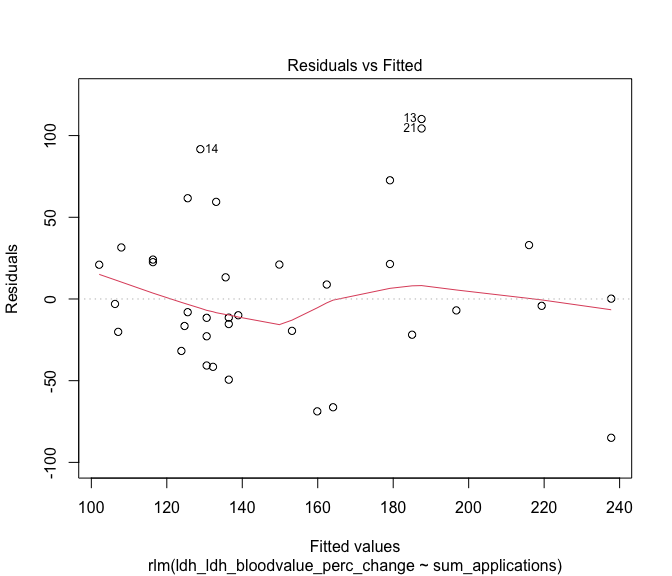
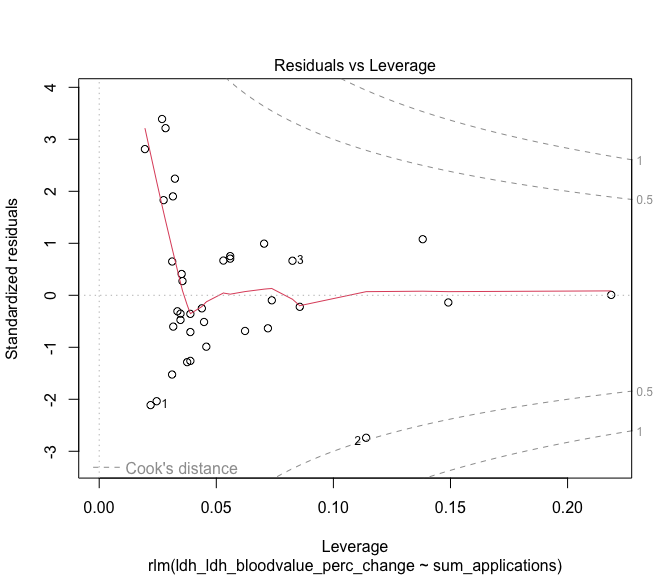

# Start with a clean slate


# Import the raw data - Point to the correct raw data directory


# Regression

## Set seed for reproducibility

We found that asymptotic confidence intervals changed with each computation, unless we set a seed within each emmeans code chunk. We also tested setting a global seed 


## Make Regression Data


## Number of Applications vs. Lab Values - Percent Change from V0 -> V1

### Haptoglobin 

#### Robust Linear Regression


##### Post-Hoc


```
## 
## Call: rlm(formula = serumhaptoglobin_serumhaptoglobin_bloodvalue_perc_change ~ 
##     sum_applications, data = reg_dat)
## Residuals:
##      Min       1Q   Median       3Q      Max 
## -50.2977 -11.2280   0.2665  12.5703 114.1673 
## 
## Coefficients:
##                  Value   Std. Error t value
## (Intercept)      86.4159  6.8834    12.5543
## sum_applications -0.3423  0.0911    -3.7585
## 
## Residual standard error: 17.25 on 34 degrees of freedom
##   (1 observation deleted due to missingness)
```

<!-- --><!-- --><!-- --><!-- -->

<div class="kable-table">

| sum_applications|   emmean|       SE| df| asymp.LCL| asymp.UCL|
|----------------:|--------:|--------:|--:|---------:|---------:|
|               25| 77.85858| 5.199690| NA|  65.53073|  90.18643|
|               50| 69.30124| 4.130460| NA|  59.50840|  79.09407|
|               75| 60.74390| 4.177603| NA|  50.83929|  70.64850|
|              100| 52.18655| 5.311477| NA|  39.59367|  64.77944|
|              125| 43.62921| 7.024168| NA|  26.97574|  60.28269|
|              150| 35.07187| 8.990764| NA|  13.75583|  56.38791|

</div>


##### Plot Results


```
## `geom_smooth()` using formula = 'y ~ x'
```

```
## Warning: Removed 1 row containing non-finite outside the scale range
## (`stat_smooth()`).
```

```
## Warning: Removed 1 row containing missing values or values outside the scale range
## (`geom_point()`).
```

<!-- -->

### Bilirubin 

#### Robust Linear Regression


##### Post-Hoc


```
## 
## Call: rlm(formula = bilirubin_bilirubin_bloodvalue_perc_change ~ sum_applications, 
##     data = reg_dat)
## Residuals:
##     Min      1Q  Median      3Q     Max 
## -60.102 -26.076  -2.118  25.047 187.580 
## 
## Coefficients:
##                  Value    Std. Error t value 
## (Intercept)      130.3898  13.8845     9.3910
## sum_applications   0.2353   0.1837     1.2807
## 
## Residual standard error: 38.97 on 34 degrees of freedom
##   (1 observation deleted due to missingness)
```

<!-- --><!-- --><!-- --><!-- -->


```
## 
## 	robust F-test (as if non-random weights)
## 
## data:  from rlm(formula = bilirubin_bilirubin_bloodvalue_perc_change ~ sum_applications, from     data = reg_dat)
## F = 1.6764, p-value = 0.2041
## alternative hypothesis: true sum_applications is not equal to 0
```

<div class="kable-table">

| sum_applications|   emmean|        SE| df| asymp.LCL| asymp.UCL|
|----------------:|--------:|---------:|--:|---------:|---------:|
|               25| 136.2713| 10.488385| NA|  111.4046|  161.1381|
|               50| 142.1529|  8.331623| NA|  122.3996|  161.9062|
|               75| 148.0344|  8.426717| NA|  128.0556|  168.0131|
|              100| 153.9159| 10.713873| NA|  128.5146|  179.3172|
|              125| 159.7974| 14.168574| NA|  126.2054|  193.3895|
|              150| 165.6790| 18.135429| NA|  122.6820|  208.6759|

</div>

##### Plot Results


```
## `geom_smooth()` using formula = 'y ~ x'
```

```
## Warning: Removed 1 row containing non-finite outside the scale range
## (`stat_smooth()`).
```

```
## Warning: Removed 1 row containing missing values or values outside the scale range
## (`geom_point()`).
```

<!-- -->

### Lactate Dehydrogenase 

#### Robust Linear Regression


##### Post-Hoc


```
## 
## Call: rlm(formula = ldh_ldh_bloodvalue_perc_change ~ sum_applications, 
##     data = reg_dat)
## Residuals:
##    Min     1Q Median     3Q    Max 
## -84.95 -20.57  -5.59  22.94 110.14 
## 
## Coefficients:
##                  Value   Std. Error t value
## (Intercept)      99.5720 12.3863     8.0389
## sum_applications  0.8376  0.1639     5.1108
## 
## Residual standard error: 32.93 on 34 degrees of freedom
##   (1 observation deleted due to missingness)
```

<!-- --><!-- --><!-- --><!-- -->


```
## 
## 	robust F-test (as if non-random weights)
## 
## data:  from rlm(formula = ldh_ldh_bloodvalue_perc_change ~ sum_applications, from     data = reg_dat)
## F = 25.503, p-value = 1.479e-05
## alternative hypothesis: true sum_applications is not equal to 0
```

<div class="kable-table">

| sum_applications|   emmean|        SE| df| asymp.LCL| asymp.UCL|
|----------------:|--------:|---------:|--:|---------:|---------:|
|               25| 120.5112|  9.356635| NA|  98.32777|  142.6947|
|               50| 141.4505|  7.432598| NA| 123.82870|  159.0723|
|               75| 162.3898|  7.517431| NA| 144.56685|  180.2127|
|              100| 183.3291|  9.557791| NA| 160.66867|  205.9895|
|              125| 204.2683| 12.639712| NA| 174.30107|  234.2356|
|              150| 225.2076| 16.178523| NA| 186.85023|  263.5650|

</div>


##### Plot Results


```
## `geom_smooth()` using formula = 'y ~ x'
```

```
## Warning: Removed 1 row containing non-finite outside the scale range
## (`stat_smooth()`).
```

```
## Warning: Removed 1 row containing missing values or values outside the scale range
## (`geom_point()`).
```

<!-- -->

### Potassium

#### Robust Linear Regression


##### Post-Hoc


```
## 
## Call: rlm(formula = potassium_potassium_bloodvalue_perc_change ~ sum_applications, 
##     data = reg_dat)
## Residuals:
##      Min       1Q   Median       3Q      Max 
## -14.1426  -2.6100   0.2537   2.5331  18.4287 
## 
## Coefficients:
##                  Value   Std. Error t value
## (Intercept)      95.1609  1.5446    61.6095
## sum_applications -0.0038  0.0204    -0.1863
## 
## Residual standard error: 3.767 on 35 degrees of freedom
```

<!-- --><!-- --><!-- --><!-- -->


```
## 
## 	robust F-test (as if non-random weights)
## 
## data:  from rlm(formula = potassium_potassium_bloodvalue_perc_change ~ sum_applications, from     data = reg_dat)
## F = 0.032808, p-value = 0.8573
## alternative hypothesis: true sum_applications is not equal to 0
```

<div class="kable-table">

| sum_applications|   emmean|        SE| df| asymp.LCL| asymp.UCL|
|----------------:|--------:|---------:|--:|---------:|---------:|
|               25| 95.06586| 1.1638439| NA|  92.30476|  97.82696|
|               50| 94.97087| 0.9183092| NA|  92.79228|  97.14947|
|               75| 94.87588| 0.9230409| NA|  92.68606|  97.06570|
|              100| 94.78089| 1.1750195| NA|  91.99328|  97.56851|
|              125| 94.68590| 1.5586183| NA|  90.98824|  98.38357|
|              150| 94.59091| 1.9994661| NA|  89.84738|  99.33444|

</div>

##### Plot Results


```
## `geom_smooth()` using formula = 'y ~ x'
```

<!-- -->


# 15kV ONLY

### Haptoglobin 

#### Robust Linear Regression


##### Post-Hoc


```
## 
## Call: rlm(formula = serumhaptoglobin_serumhaptoglobin_bloodvalue_perc_change ~ 
##     sum_applications, data = reg_dat_15kV)
## Residuals:
##     Min      1Q  Median      3Q     Max 
## -45.680 -13.837   1.638  10.551  89.711 
## 
## Coefficients:
##                  Value   Std. Error t value
## (Intercept)      82.6597  9.3591     8.8320
## sum_applications -0.3669  0.1162    -3.1563
## 
## Residual standard error: 20.71 on 22 degrees of freedom
##   (1 observation deleted due to missingness)
```

<!-- --><!-- --><!-- --><!-- -->

<div class="kable-table">

| sum_applications|   emmean|        SE| df| asymp.LCL| asymp.UCL|
|----------------:|--------:|---------:|--:|---------:|---------:|
|               25| 73.48727|  7.172690| NA|  56.48259|  90.49196|
|               50| 64.31490|  5.673822| NA|  50.86366|  77.76613|
|               75| 55.14252|  5.461463| NA|  42.19473|  68.09031|
|              100| 45.97014|  6.659839| NA|  30.18130|  61.75898|
|              125| 36.79776|  8.704589| NA|  16.16133|  57.43420|
|              150| 27.62539| 11.138978| NA|   1.21761|  54.03316|

</div>


##### Plot Results


```
## `geom_smooth()` using formula = 'y ~ x'
```

```
## Warning: Removed 1 row containing non-finite outside the scale range
## (`stat_smooth()`).
```

```
## Warning: Removed 1 row containing missing values or values outside the scale range
## (`geom_point()`).
```

<!-- -->

### Bilirubin 

#### Robust Linear Regression


##### Post-Hoc


```
## 
## Call: rlm(formula = bilirubin_bilirubin_bloodvalue_perc_change ~ sum_applications, 
##     data = reg_dat_15kV)
## Residuals:
##     Min      1Q  Median      3Q     Max 
## -61.643 -45.443  -7.997  36.575 185.090 
## 
## Coefficients:
##                  Value    Std. Error t value 
## (Intercept)      134.4912  17.8047     7.5537
## sum_applications   0.1833   0.2211     0.8288
## 
## Residual standard error: 67.58 on 22 degrees of freedom
##   (1 observation deleted due to missingness)
```

<!-- --><!-- --><!-- --><!-- -->

<div class="kable-table">

| sum_applications|   emmean|       SE| df| asymp.LCL| asymp.UCL|
|----------------:|--------:|--------:|--:|---------:|---------:|
|               25| 139.0735| 13.64526| NA|  106.7240|  171.4231|
|               50| 143.6558| 10.79383| NA|  118.0663|  169.2453|
|               75| 148.2381| 10.38984| NA|  123.6063|  172.8698|
|              100| 152.8204| 12.66962| NA|  122.7838|  182.8569|
|              125| 157.4026| 16.55953| NA|  118.1441|  196.6612|
|              150| 161.9849| 21.19069| NA|  111.7470|  212.2228|

</div>


##### Plot Results


```
## `geom_smooth()` using formula = 'y ~ x'
```

```
## Warning: Removed 1 row containing non-finite outside the scale range
## (`stat_smooth()`).
```

```
## Warning: Removed 1 row containing missing values or values outside the scale range
## (`geom_point()`).
```

<!-- -->

# Version and Package Details


```
## [1] "R version 4.4.0 (2024-04-24) Puppy Cup"
```

```
## [1] "RStudio Version 2024.4.2.764 Chocolate Cosmos"
```

<div class="kable-table">

|        |package |loadedversion |
|:-------|:-------|:-------------|
|cowplot |cowplot |1.1.3         |
|dplyr   |dplyr   |1.1.4         |
|emmeans |emmeans |1.10.2        |
|ggplot2 |ggplot2 |3.5.1         |
|MASS    |MASS    |7.3-61        |
|sfsmisc |sfsmisc |1.1-18        |

</div>

# Detach Packages before moving on


```
## Warning: 'MASS' namespace cannot be unloaded:
##   namespace 'MASS' is imported by 'TH.data' so cannot be unloaded
```

# When were these files last rewritten?


```
## [1] "Mon Dec  2 15:05:18 2024"
```
