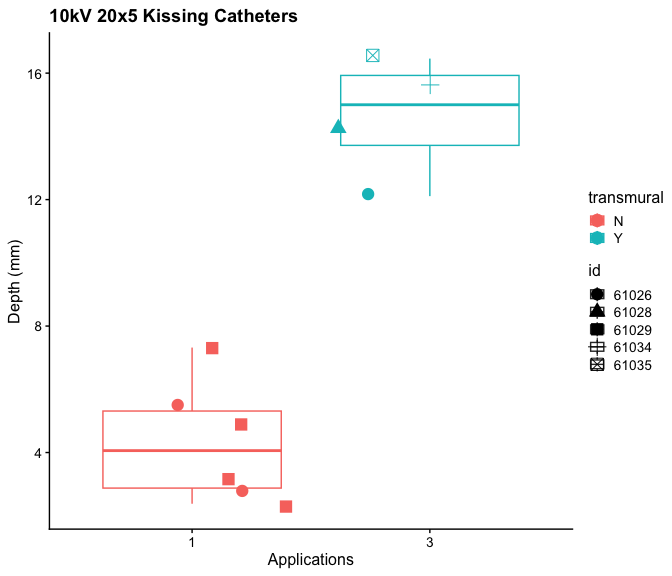

# Start with a clean slate


# Import the cleaned data - Point to the correct raw data directory


## Import Subject Data


# Descriptive Statistics

## Summary Table of Subjects 

```
## `summarise()` has grouped output by 'species', 'waveform', 'voltage'. You can
## override using the `.groups` argument.
## Joining with `by = join_by(species, waveform, voltage, pulse_seq)`
```

<div class="kable-table">

|species |waveform |voltage |pulse_seq |  n| median_depth| IQR_depth| median_diameter| IQR_diameter| median_depth_per_width| IQR_depth_per_width|
|:-------|:--------|:-------|:---------|--:|------------:|---------:|---------------:|------------:|----------------------:|-------------------:|
|Potato  |bipolar  |10      |10x5      | 30|         9.35|     2.925|           23.00|        1.075|                  0.410|              0.1225|
|Potato  |bipolar  |10      |20x5      | 30|         5.25|     1.000|           17.35|        2.750|                  0.310|              0.0275|
|Potato  |unipolar |15      |15x5      | 30|        16.00|     7.925|           41.00|       12.000|                  0.390|              0.0925|
|Potato  |unipolar |15      |20x5      | 30|        15.75|     3.000|           52.00|       12.400|                  0.330|              0.0400|
|Potato  |unipolar |15      |3x12x3    | 40|        14.00|     1.250|           43.00|        4.250|                  0.310|              0.0200|
|Swine   |unipolar |15      |3x12x3    |  2|        13.50|     0.500|           28.00|        2.000|                  0.485|              0.0150|

</div>


```
## `summarise()` has grouped output by 'species', 'waveform', 'voltage',
## 'pulse_seq'. You can override using the `.groups` argument.
## Joining with `by = join_by(species, waveform, voltage, pulse_seq,
## application_num)`
```

<div class="kable-table">

|species |waveform |voltage |pulse_seq | application_num|  n| median_depth| IQR_depth|
|:-------|:--------|:-------|:---------|---------------:|--:|------------:|---------:|
|Swine   |kissing  |10      |20x5      |               1|  6|         4.06|    2.4375|
|Swine   |kissing  |10      |20x5      |               3|  4|        15.00|    2.2125|

</div>


```
## `summarise()` has grouped output by 'species', 'waveform', 'voltage',
## 'pulse_seq'. You can override using the `.groups` argument.
## Joining with `by = join_by(species, waveform, voltage, pulse_seq,
## application_num)`
```

<div class="kable-table">

|species |waveform |voltage |pulse_seq | application_num|  n| median_diameter| IQR_diameter|
|:-------|:--------|:-------|:---------|---------------:|--:|---------------:|------------:|
|Swine   |kissing  |10      |20x5      |               1| 12|           8.105|       4.8275|
|Swine   |kissing  |10      |20x5      |               3| 16|          11.115|       6.4675|

</div>

# Plots

## Depth

### Depth Dose-Response - Line Plots

<!-- -->

### 15kV 3x12x3 Unipolar Full Depth Curve


<!-- -->

### 10kV 20x5 Kissing Catheters - 1 vs 3 applications


```
## Warning: The following aesthetics were dropped during statistical transformation: shape.
## ℹ This can happen when ggplot fails to infer the correct grouping structure in
##   the data.
## ℹ Did you forget to specify a `group` aesthetic or to convert a numerical
##   variable into a factor?
```

<!-- -->

#### Depth Dose-Response - Smoothed Line Plots


```
## `geom_smooth()` using method = 'loess' and formula = 'y ~ x'
```

```
## Warning: Removed 4 rows containing non-finite outside the scale range
## (`stat_smooth()`).
```

<!-- -->

## Diameter Dose-Response

### Diameter line plots 

<!-- -->
### 15kV 3x12x3 Unipolar Full Diameter Curve

<!-- -->

### 10kV 20x5 Kissing Catheters - 1 vs 3 applications


```
## Warning: The following aesthetics were dropped during statistical transformation: shape.
## ℹ This can happen when ggplot fails to infer the correct grouping structure in
##   the data.
## ℹ Did you forget to specify a `group` aesthetic or to convert a numerical
##   variable into a factor?
```

<!-- -->

#### Depth Dose-Response - Smoothed Line Plots


```
## `geom_smooth()` using method = 'loess' and formula = 'y ~ x'
```

```
## Warning: Removed 4 rows containing non-finite outside the scale range
## (`stat_smooth()`).
```

<!-- -->


#### Diameter Dose-Response - Smoothed Line Plots


```
## `geom_smooth()` using method = 'loess' and formula = 'y ~ x'
```

```
## Warning: Removed 6 rows containing non-finite outside the scale range
## (`stat_smooth()`).
```

<!-- -->

## Depth/Diameter Ratio

### Depth/Diameter Ratio line plots 

<!-- -->


### Depth/Diameter Ratio LOESS line plots 


```
## `geom_smooth()` using method = 'loess' and formula = 'y ~ x'
```

```
## Warning: Removed 6 rows containing non-finite outside the scale range
## (`stat_smooth()`).
```

<!-- -->


# Version and Package Details


```
## [1] "R version 4.4.0 (2024-04-24) Puppy Cup"
```

```
## [1] "RStudio Version 2024.4.2.764 Chocolate Cosmos"
```

<div class="kable-table">

|         |package  |loadedversion |
|:--------|:--------|:-------------|
|cowplot  |cowplot  |1.1.3         |
|dplyr    |dplyr    |1.1.4         |
|ggplot2  |ggplot2  |3.5.1         |
|janitor  |janitor  |2.2.0         |
|knitr    |knitr    |1.47          |
|lme4     |lme4     |1.1-35.3      |
|lmerTest |lmerTest |3.1-3         |
|Matrix   |Matrix   |1.7-0         |

</div>

# When were these files last rewritten?


```
## [1] "Fri Nov  1 14:51:55 2024"
```
