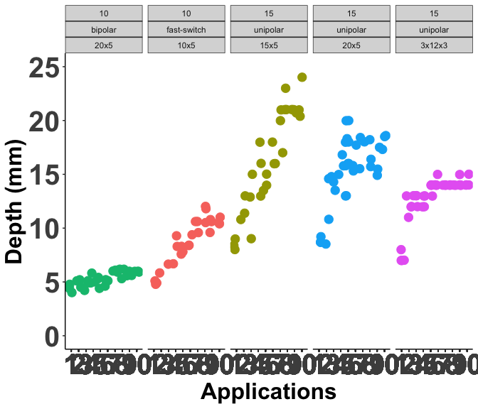
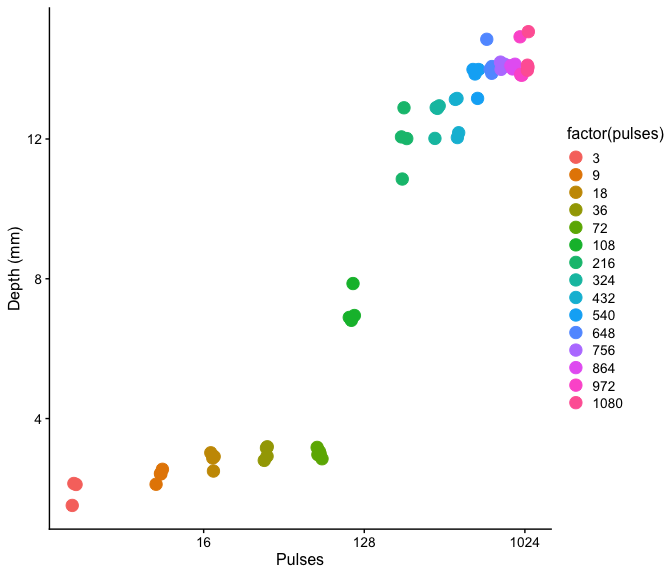
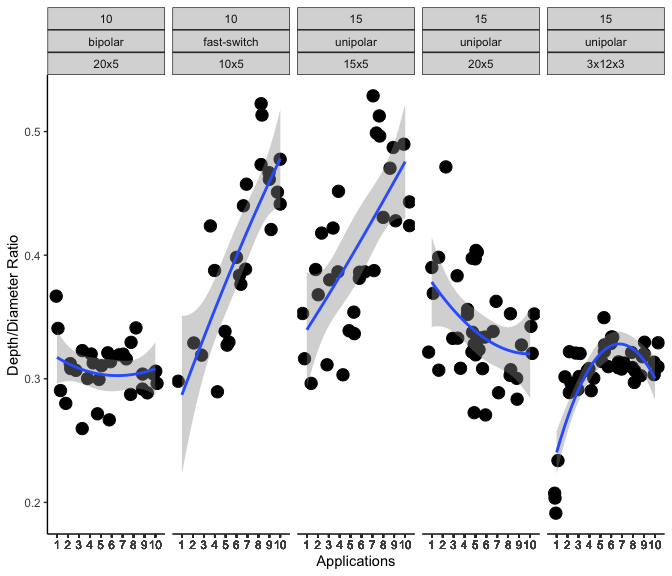

# Start with a clean slate


# Import the cleaned data - Point to the correct raw data directory


# Aesthetics


## Import Subject Data


# Descriptive Statistics

## Summary Table of Subjects 

```
## `summarise()` has grouped output by 'waveform', 'voltage'. You can override
## using the `.groups` argument.
## Joining with `by = join_by(waveform, voltage, pulse_seq)`
```

<div class="kable-table">

|waveform    |voltage |pulse_seq |  n| median_depth| IQR_depth| median_diameter| IQR_diameter| median_depth_per_width| IQR_depth_per_width|
|:-----------|:-------|:---------|--:|------------:|---------:|---------------:|------------:|----------------------:|-------------------:|
|bipolar     |10      |20x5      | 30|         5.25|     1.000|           17.35|        2.750|                   0.31|              0.0275|
|fast-switch |10      |10x5      | 30|         9.35|     2.925|           23.00|        1.075|                   0.41|              0.1225|
|unipolar    |15      |15x5      | 30|        16.00|     7.925|           41.00|       12.000|                   0.39|              0.0925|
|unipolar    |15      |20x5      | 30|        15.75|     3.000|           52.00|       12.400|                   0.33|              0.0400|

</div>

# Plots

## Depth

### Depth Dose-Response - Line Plots


```
## Warning: Removed 4 rows containing missing values or values outside the scale range
## (`geom_point()`).
```

<!-- -->

```
## Warning: Removed 4 rows containing missing values or values outside the scale range
## (`geom_point()`).
```

### Depth Dose-Response - Smoothed Line Plots


```
## `geom_smooth()` using method = 'loess' and formula = 'y ~ x'
```

```
## Warning: Removed 4 rows containing non-finite outside the scale range
## (`stat_smooth()`).
```

```
## Warning: Removed 4 rows containing missing values or values outside the scale range
## (`geom_point()`).
```

<!-- -->

## Diameter Dose-Response

### Diameter line plots 


```
## Warning: Removed 6 rows containing missing values or values outside the scale range
## (`geom_point()`).
```

<!-- -->

```
## Warning: Removed 6 rows containing missing values or values outside the scale range
## (`geom_point()`).
```

### Diameter Dose-Response - Smoothed Line Plots


```
## `geom_smooth()` using method = 'loess' and formula = 'y ~ x'
```

```
## Warning: Removed 6 rows containing non-finite outside the scale range
## (`stat_smooth()`).
```

```
## Warning: Removed 6 rows containing missing values or values outside the scale range
## (`geom_point()`).
```

<!-- -->

## Depth/Diameter Ratio

### Depth/Diameter Ratio line plots 


```
## Warning: Removed 6 rows containing missing values or values outside the scale range
## (`geom_point()`).
```

<!-- -->

```
## Warning: Removed 6 rows containing missing values or values outside the scale range
## (`geom_point()`).
```


### Depth/Diameter Ratio LOESS line plots 


```
## `geom_smooth()` using method = 'loess' and formula = 'y ~ x'
```

```
## Warning: Removed 6 rows containing non-finite outside the scale range
## (`stat_smooth()`).
```

```
## Warning: Removed 6 rows containing missing values or values outside the scale range
## (`geom_point()`).
```

<!-- -->


# Version and Package Details


```
## [1] "R version 4.4.0 (2024-04-24) Puppy Cup"
```

```
## [1] "RStudio Version 2024.4.2.764 Chocolate Cosmos"
```

<div class="kable-table">

|         |package  |loadedversion |
|:--------|:--------|:-------------|
|dplyr    |dplyr    |1.1.4         |
|ggplot2  |ggplot2  |3.5.1         |
|janitor  |janitor  |2.2.0         |
|knitr    |knitr    |1.47          |
|lme4     |lme4     |1.1-35.3      |
|lmerTest |lmerTest |3.1-3         |
|Matrix   |Matrix   |1.7-0         |

</div>

# When were these files last rewritten?


```
## [1] "Fri Aug  2 07:13:17 2024"
```
