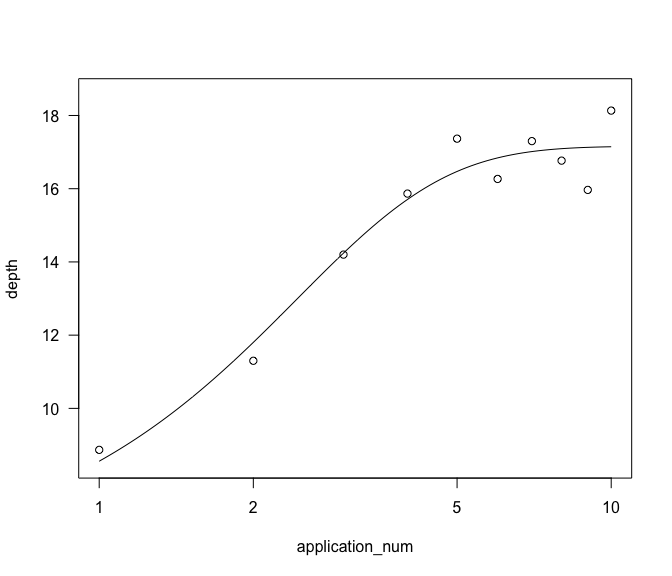
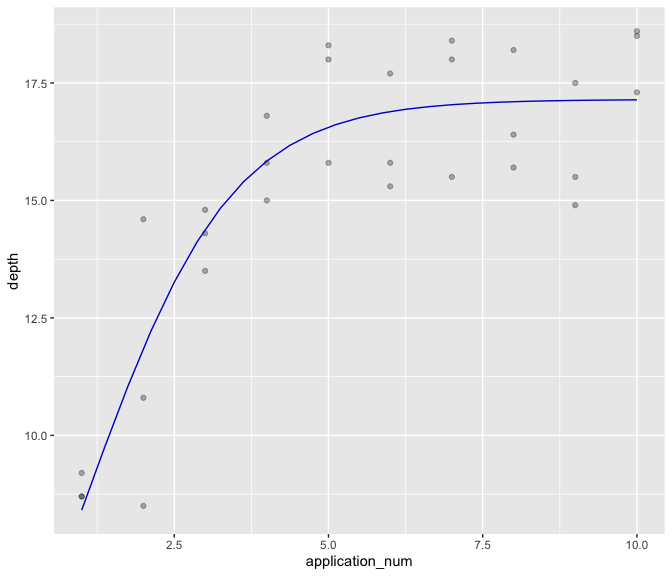

# Start with a clean slate


# Import the cleaned data - Point to the correct raw data directory


# Aesthetics


## Import Subject Data


# Regression Data


## 3-Parameter Nonlinear Logisitic Regression

We don't have enough data to accurately model the floor, so we'll only model the Slope, Upper Limit, and ED50.

b = steepness, e = ED50, d = upper limit, c = lower limit, f = asymmetry
meL.3(x, b, d, e)
meL.4(x, b, c, d, e)

### Nonlinear 3-parameter logisitic regression 


```
## 
## Model fitted: Logistic (ED50 as parameter) with lower limit fixed at 0 (3 parms)
## 
## Parameter estimates:
## 
##                         Estimate Std. Error t-value   p-value    
## Slope:(Intercept)       -0.79513    0.15476 -5.1377 2.104e-05 ***
## Upper Limit:(Intercept) 17.15935    0.39262 43.7047 < 2.2e-16 ***
## ED50:(Intercept)         1.00652    0.21451  4.6923 6.964e-05 ***
## ---
## Signif. codes:  0 '***' 0.001 '**' 0.01 '*' 0.05 '.' 0.1 ' ' 1
## 
## Residual standard error:
## 
##  1.409737 (27 degrees of freedom)
```

<!-- -->

### 3 parameter logistic mixed effects - metadrm = nlme


```
## 
## Two-stage meta-analysis dose-response model
## Model fitted: Logistic (ED50 as parameter) with lower limit fixed at 0
## 
## Call:
## metadrm(formula = depth ~ application_num, fct = L.3(names = c("Slope", 
##     "Upper Limit", "ED50")), ind = id, data = reg_dat, struct = "UN")
## 
## Variance estimates:
##             estim    sqrt
## tau^2.1    0.0158  0.1258
## tau^2.2    0.0081  0.0901
## tau^2.3    0.1947  0.4412
## 
##                          rho.ED50  rho.S:(I  rho.UL:(
## ED50:(Intercept)                1    1.0000    1.0000
## Slope:(Intercept)          1.0000         1    1.0000
## Upper Limit:(Intercept)    1.0000    1.0000         1
## 
## 
## Coefficients:
##                         Estimate  Std.Err t value  Pr(>|t|)    
## Slope:(Intercept)        1.06725  0.17876  5.9702   0.00099 ***
## Upper Limit:(Intercept) -0.78932  0.15612 -5.0560   0.00232 ** 
## ED50:(Intercept)        17.04107  0.43760 38.9419 1.916e-08 ***
## ---
## Signif. codes:  0 '***' 0.001 '**' 0.01 '*' 0.05 '.' 0.1 ' ' 1
```


```
## Warning in nlme.formula(depth ~ meL.3(application_num, b, d, e), fixed = b + :
## Iteration 1, LME step: nlminb() did not converge (code = 1). Do increase
## 'msMaxIter'!
```

```
## Nonlinear mixed-effects model fit by maximum likelihood
##   Model: depth ~ meL.3(application_num, b, d, e) 
##   Data: data 
##        AIC      BIC    logLik
##   121.4102 135.4221 -50.70508
## 
## Random effects:
##  Formula: list(b ~ 1, d ~ 1, e ~ 1)
##  Level: id
##  Structure: General positive-definite, Log-Cholesky parametrization
##          StdDev    Corr  
## b        0.1501729 b    d
## d        0.3766413 1     
## e        0.1820883 1    1
## Residual 1.2580598       
## 
## Fixed effects:  b + d + e ~ 1 
##       Value Std.Error DF  t-value p-value
## b -0.843138 0.1777109 25 -4.74444   1e-04
## d 17.149204 0.4331614 25 39.59079   0e+00
## e  1.045304 0.2186807 25  4.78004   1e-04
##  Correlation: 
##   b      d     
## d  0.660       
## e -0.072  0.365
## 
## Standardized Within-Group Residuals:
##         Min          Q1         Med          Q3         Max 
## -2.19943670 -0.63241788  0.08067559  0.80622171  1.50692250 
## 
## Number of Observations: 30
## Number of Groups: 3
```
<!-- -->

# Version and Package Details


```
## [1] "R version 4.4.0 (2024-04-24) Puppy Cup"
```

```
## [1] "RStudio Version 2024.4.2.764 Chocolate Cosmos"
```

<div class="kable-table">

|         |package  |loadedversion |
|:--------|:--------|:-------------|
|aomisc   |aomisc   |0.652         |
|dplyr    |dplyr    |1.1.4         |
|drc      |drc      |3.2-0         |
|drcData  |drcData  |1.1-3         |
|emmeans  |emmeans  |1.10.2        |
|ggplot2  |ggplot2  |3.5.1         |
|knitr    |knitr    |1.47          |
|MASS     |MASS     |7.3-61        |
|Matrix   |Matrix   |1.7-0         |
|medrc    |medrc    |1.1-0         |
|metadat  |metadat  |1.2-0         |
|metafor  |metafor  |4.6-0         |
|nlme     |nlme     |3.1-165       |
|numDeriv |numDeriv |2016.8-1.1    |

</div>

# When were these files last rewritten?


```
## [1] "Tue Jul 30 14:34:51 2024"
```
