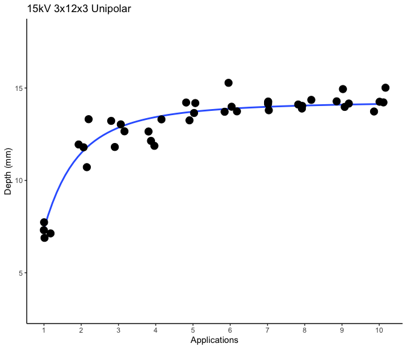
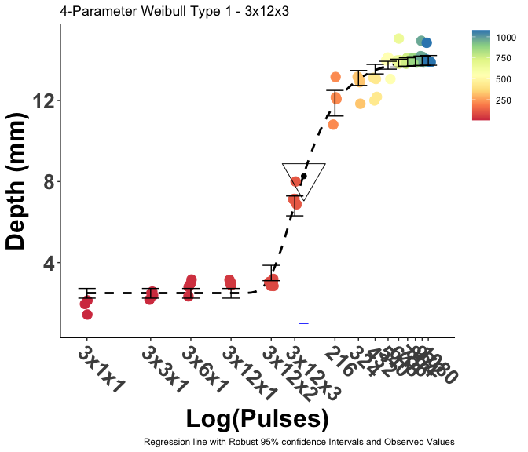
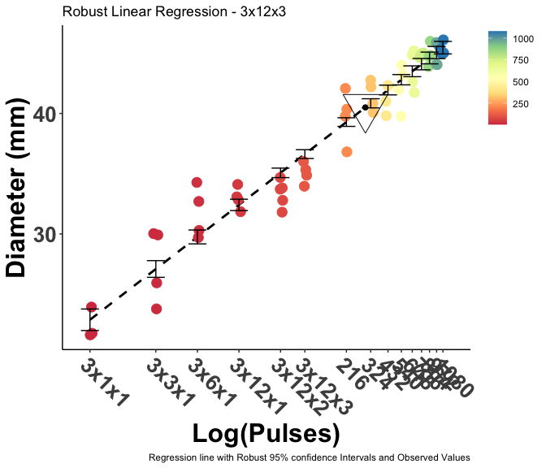
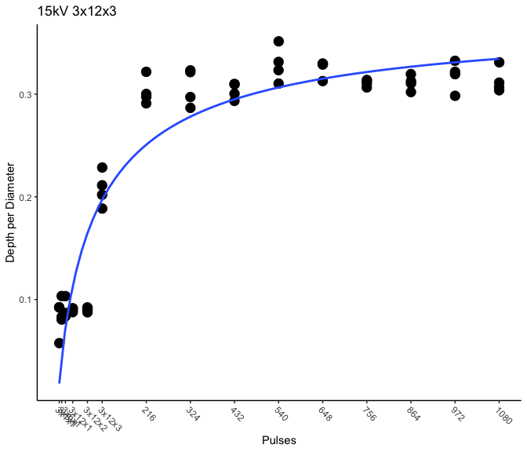

# Start with a clean slate


# Import the cleaned data - Point to the correct raw data directory


# Aesthetics


## Import Subject Data


# Regression Fitting

## 15 kV Unipolar 3x12x3

### Depth

#### Model Selection


```
##          logLik        IC Lack of fit   Res var
## LL.3  -34.03993  76.07985           0 0.3471775
## LL2.3 -34.03993  76.07986           0 0.3471775
## AR.2  -37.73132  81.46263           0 0.4065624
## AR.2  -37.73132  81.46263           0 0.4065624
## L.3   -39.94481  87.88962           0 0.4664171
## MM.2  -43.65760  93.31520           0 0.5467827
## Cubic -44.44002  98.88005          NA 0.6001862
## Quad  -53.79453 115.58905          NA 0.9322174
## Lin   -69.44092 144.88184          NA 1.9846890
```

#### 3-Parameter Log-Logistic Regression


##### Post-Hoc


```
## 
## Model fitted: Log-logistic (ED50 as parameter) with lower limit at 0 (3 parms)
## 
## Parameter estimates:
## 
##                          Estimate Std. Error t-value   p-value    
## b:(Intercept)           -1.935624   0.229506 -8.4339 3.837e-10 ***
## Upper Limit:(Intercept) 14.285766   0.211836 67.4380 < 2.2e-16 ***
## Inflection:(Intercept)   0.965387   0.040908 23.5990 < 2.2e-16 ***
## ---
## Signif. codes:  0 '***' 0.001 '**' 0.01 '*' 0.05 '.' 0.1 ' ' 1
## 
## Residual standard error:
## 
##  0.5892177 (37 degrees of freedom)
```


```
##         1         2         3         4         5         6         7         8 
##  7.386309 11.482092 12.853922 13.428616 13.717289 13.881547 13.983621 14.051310 
##         9        10 
## 14.098480 14.132661
```

#### Plotting


```
## `geom_smooth()` using formula = 'y ~ x'
```

<!-- -->

### Full Depth Curve

#### Model Selection 


```
##           logLik       IC Lack of fit   Res var
## W1.4   -51.19177 122.8553           0 0.3455936
## LL2.5  -51.34011 127.2463           0 0.3536214
## LL.5   -51.79417 128.1544           0 0.3590142
## LL2.4  -59.33317 139.1381           0 0.4533404
## LL2.4  -59.33317 139.1381           0 0.4533404
## LL.4   -59.33317 139.1381           0 0.4533404
## L.5    -63.79397 152.1540           0 0.5355827
## L.3    -68.76566 153.9087           0 0.6099398
## L.4    -67.25674 154.9852           0 0.5903776
## W2.4   -67.40700 155.2857           0 0.5933420
## Cubic  -82.39557 185.2629          NA 0.9778832
## LL.3   -93.97364 204.3247           0 1.4132203
## LL2.3  -93.97364 204.3247           0 1.4132203
## Quad  -103.56956 223.5165          NA 1.9459198
## Lin   -143.79803 299.8791          NA 7.3103583
```

#### Four-Parameter Weibull Type 1 

https://setac.onlinelibrary.wiley.com/doi/10.1002/etc.7

The present study considers four different classes of sigmoidal dose–response models with horizontal asymptotes or limits at the extremes of the dose range. It will be shown below that these four classes encompass many of the dose–response models that are useful to ecotoxicologists. The classes are called log-logistic models, log-normal models, Weibull-1 models, and Weibull-2 models

https://www.r-bloggers.com/2019/11/five-parameters-logistic-regression/


##### Post-Hoc


```
## 
## Model fitted: Weibull (type 1) (4 parms)
## 
## Parameter estimates:
## 
##                          Estimate Std. Error t-value   p-value    
## b:(Intercept)            -2.23946    0.19575 -11.440 3.616e-16 ***
## Lower Limit:(Intercept)   2.48417    0.14657  16.948 < 2.2e-16 ***
## Upper Limit:(Intercept)  14.04763    0.15492  90.676 < 2.2e-16 ***
## e:(Intercept)           107.32961    3.04394  35.260 < 2.2e-16 ***
## ---
## Signif. codes:  0 '***' 0.001 '**' 0.01 '*' 0.05 '.' 0.1 ' ' 1
## 
## Residual standard error:
## 
##  0.5878721 (56 degrees of freedom)
```


```
## 
## Estimated effective doses
## 
##        Estimate Std. Error    Lower    Upper
## e:1:50 126.4145     5.1408 116.1162 136.7128
```

#### Plotting 


```
## `geom_smooth()` using formula = 'y ~ x'
```

<!-- -->

```
## `geom_smooth()` using formula = 'y ~ x'
```

### Diameter

#### Model Selection


```
##          logLik       IC Lack of fit   Res var
## LL.3  -148.1911 312.7596           0  8.611690
## LL2.3 -148.1911 312.7596           0  8.611690
## L.3   -149.7148 315.8071           0  9.060378
## L.3   -149.7148 315.8071           0  9.060378
## LL2.4 -148.0298 316.5313           0  8.718453
## W1.4  -148.0438 316.5593           0  8.722518
## LL.4  -148.0817 316.6350           0  8.733544
## W2.4  -148.3233 317.1183           0  8.804166
## L.4   -149.2659 319.0035           0  9.085195
## Cubic -150.6705 321.8128          NA  9.520686
## Quad  -154.0097 324.3969          NA 10.454938
## Lin   -166.5708 345.4245          NA 15.617356
```

#### Robust Log-Linear Regression 


```
## [1] 315.8071
```

```
## [1] 235.0924
```

##### Post-Hoc 


```
## 
## Call: rlm(formula = diameter ~ log(pulses), data = full_curve_3x12x3)
## Residuals:
##     Min      1Q  Median      3Q     Max 
## -3.0922 -0.9719  0.1077  0.9178  4.2485 
## 
## Coefficients:
##             Value   Std. Error t value
## (Intercept) 18.6625  0.6289    29.6770
## log(pulses)  3.8365  0.1164    32.9708
## 
## Residual standard error: 1.4 on 58 degrees of freedom
```


```
##                2.5 %   97.5 %
## log(pulses) 3.608449 4.064575
```

I need the median of the fitted function not the quantiles of the observed data


#### Plotting


<!-- -->

### Depth/Diameter Ratio


#### Model Selection


```
##          logLik       IC Lack of fit   Res var
## LL2.3 -111.1919 230.3838           0  2.508823
## LL.3  -111.2261 230.4522           0  2.511681
## L.3   -131.1258 270.2515           0  4.875754
## Cubic -132.6327 275.2654          NA  5.218477
## Quad  -140.4166 288.8332          NA  6.645696
## Lin   -160.3716 326.7432          NA 12.701819
## MM.2  -161.6835 329.3671           0 13.269604
## AR.2  -180.0511 366.1021           0 24.476813
## AR.2  -180.0511 366.1021           0 24.476813
```

#### 3-Parameter Log-Logistic Regression


```
## 
## Model fitted: Log-logistic (log(ED50) as parameter) with lower limit at 0 (3 parms)
## 
## Parameter estimates:
## 
##                Estimate Std. Error t-value   p-value    
## b:(Intercept) -0.857664   0.165998 -5.1667 3.171e-06 ***
## d:(Intercept)  0.376689   0.030329 12.4203 < 2.2e-16 ***
## e:(Intercept)  4.572208   0.237135 19.2810 < 2.2e-16 ***
## ---
## Signif. codes:  0 '***' 0.001 '**' 0.01 '*' 0.05 '.' 0.1 ' ' 1
## 
## Residual standard error:
## 
##  0.03665576 (57 degrees of freedom)
```

#### Plotting 


```
## `geom_smooth()` using formula = 'y ~ x'
```

<!-- -->

# Version and Package Details


```
## [1] "R version 4.4.0 (2024-04-24) Puppy Cup"
```

```
## [1] "RStudio Version 2024.4.2.764 Chocolate Cosmos"
```

<div class="kable-table">

|         |package  |loadedversion |
|:--------|:--------|:-------------|
|aomisc   |aomisc   |0.652         |
|dplyr    |dplyr    |1.1.4         |
|drc      |drc      |3.2-0         |
|drcData  |drcData  |1.1-3         |
|emmeans  |emmeans  |1.10.2        |
|ggplot2  |ggplot2  |3.5.1         |
|knitr    |knitr    |1.47          |
|MASS     |MASS     |7.3-61        |
|sandwich |sandwich |3.1-0         |
|sfsmisc  |sfsmisc  |1.1-18        |

</div>

# When were these files last rewritten?


```
## [1] "Sun Aug 11 23:49:19 2024"
```
