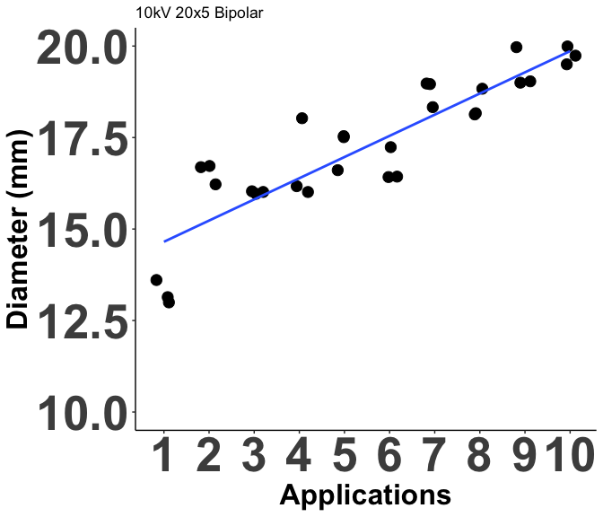
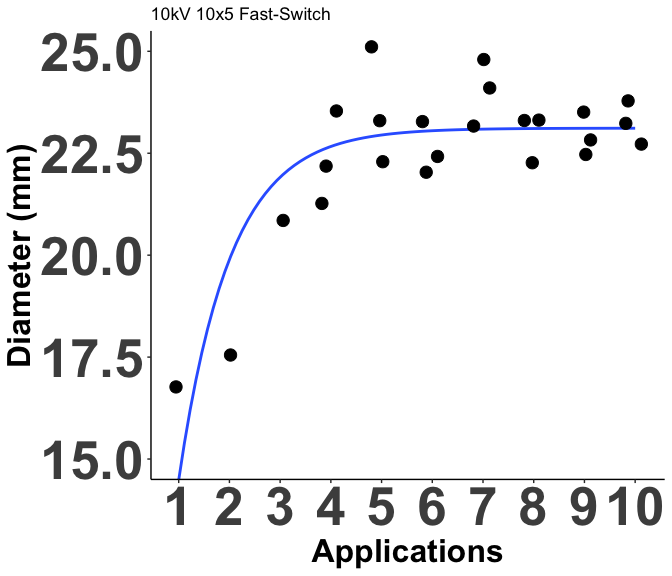
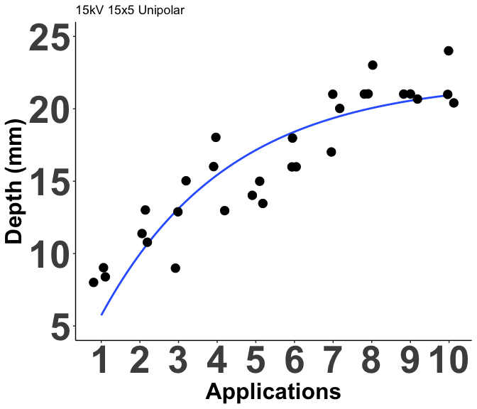
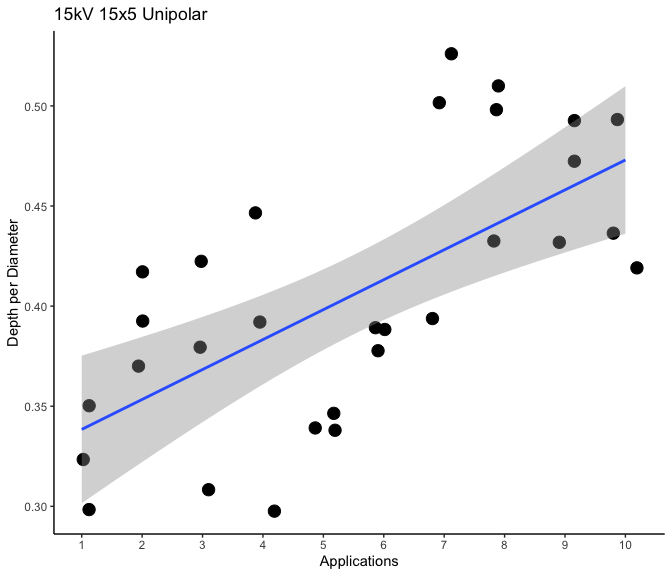
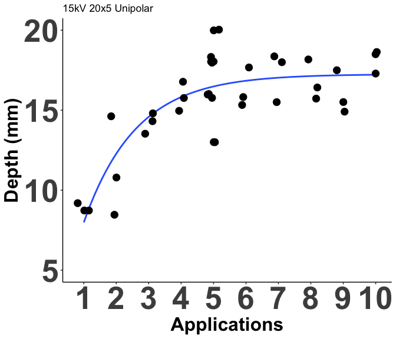
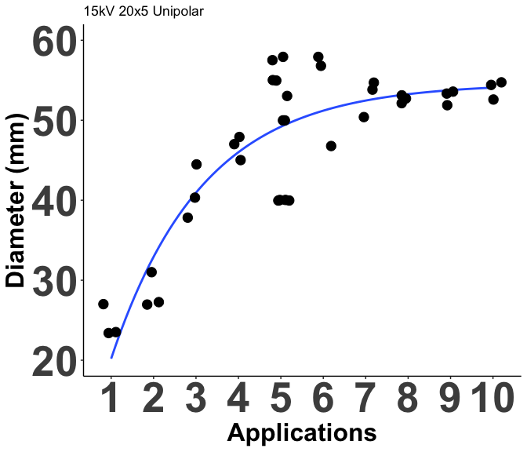
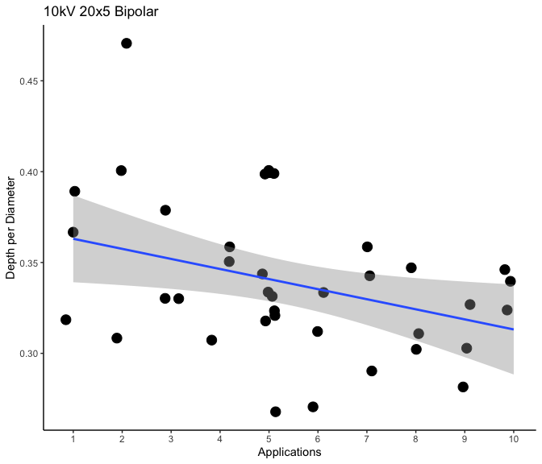
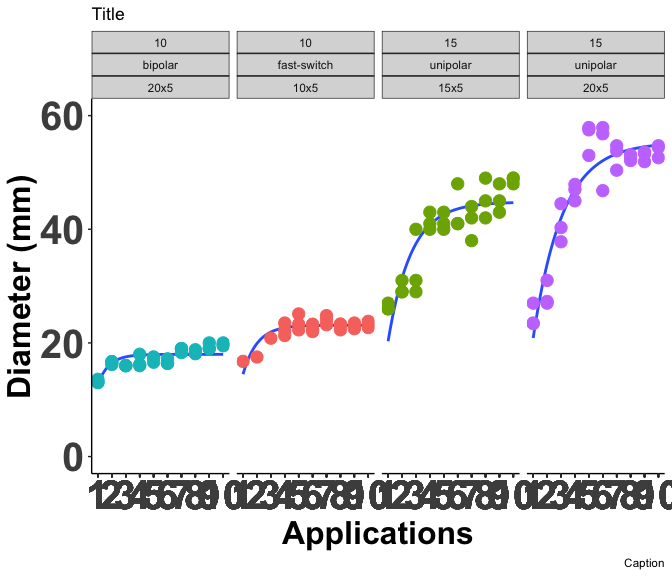
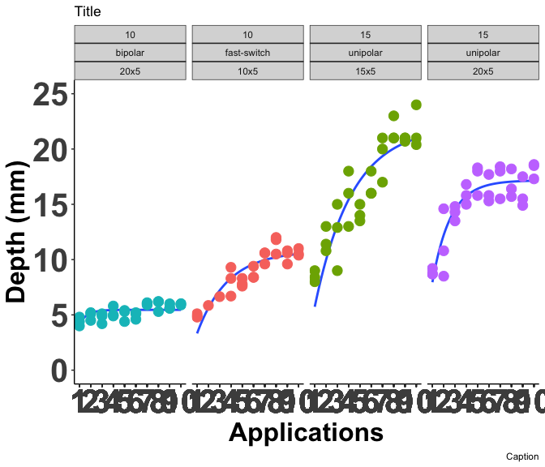
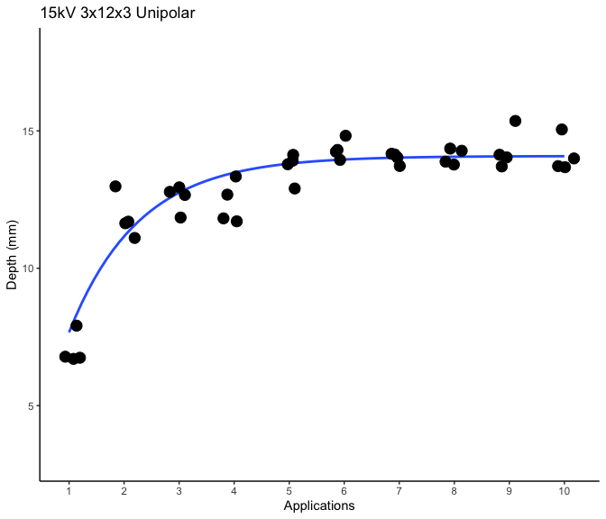

# Start with a clean slate


# Import the cleaned data - Point to the correct raw data directory


# Aesthetics


## Import Subject Data


# Regression Fitting

## 10kV 20x5 Bipolar 

### Linear Regression

#### Depth 


```
## 
## Call:
## lm(formula = depth ~ application_num, data = working_dat, subset = (voltage == 
##     10 & pulse_seq == "20x5" & waveform == "bipolar"))
## 
## Residuals:
##      Min       1Q   Median       3Q      Max 
## -0.80586 -0.25586 -0.04242  0.33500  0.76242 
## 
## Coefficients:
##                 Estimate Std. Error t value Pr(>|t|)    
## (Intercept)      4.36444    0.16361  26.677  < 2e-16 ***
## application_num  0.16828    0.02637   6.382 6.58e-07 ***
## ---
## Signif. codes:  0 '***' 0.001 '**' 0.01 '*' 0.05 '.' 0.1 ' ' 1
## 
## Residual standard error: 0.4148 on 28 degrees of freedom
## Multiple R-squared:  0.5926,	Adjusted R-squared:  0.5781 
## F-statistic: 40.73 on 1 and 28 DF,  p-value: 6.585e-07
```


```
## `geom_smooth()` using formula = 'y ~ x'
```

<!-- -->

```
## `geom_smooth()` using formula = 'y ~ x'
```


```
## 
## Model fitted: Asymptotic regression with lower limit at 0 (2 parms)
## 
## Parameter estimates:
## 
##                         Estimate Std. Error t-value   p-value    
## Upper Limit:(Intercept)  5.45477    0.11790 46.2679 < 2.2e-16 ***
## Steepness:(Intercept)    0.69152    0.13804  5.0096 2.701e-05 ***
## ---
## Signif. codes:  0 '***' 0.001 '**' 0.01 '*' 0.05 '.' 0.1 ' ' 1
## 
## Residual standard error:
## 
##  0.5498054 (28 degrees of freedom)
```


#### Diameter


```
## 
## Call:
## lm(formula = diameter ~ application_num, data = working_dat, 
##     subset = (voltage == 10 & pulse_seq == "20x5" & waveform == 
##         "bipolar"))
## 
## Residuals:
##      Min       1Q   Median       3Q      Max 
## -1.65212 -0.38318 -0.03242  0.53273  1.61152 
## 
## Coefficients:
##                 Estimate Std. Error t value Pr(>|t|)    
## (Intercept)     14.07333    0.34061   41.32  < 2e-16 ***
## application_num  0.57879    0.05489   10.54 2.95e-11 ***
## ---
## Signif. codes:  0 '***' 0.001 '**' 0.01 '*' 0.05 '.' 0.1 ' ' 1
## 
## Residual standard error: 0.8636 on 28 degrees of freedom
## Multiple R-squared:  0.7988,	Adjusted R-squared:  0.7916 
## F-statistic: 111.2 on 1 and 28 DF,  p-value: 2.953e-11
```


```
## `geom_smooth()` using formula = 'y ~ x'
```

<!-- -->

```
## `geom_smooth()` using formula = 'y ~ x'
```


```
## 
## Model fitted: Asymptotic regression with lower limit at 0 (2 parms)
## 
## Parameter estimates:
## 
##                          Estimate Std. Error t-value   p-value    
## Upper Limit:(Intercept) 17.988501   0.262948 68.4107 < 2.2e-16 ***
## Steepness:(Intercept)    0.812543   0.092507  8.7836 1.554e-09 ***
## ---
## Signif. codes:  0 '***' 0.001 '**' 0.01 '*' 0.05 '.' 0.1 ' ' 1
## 
## Residual standard error:
## 
##  1.202907 (28 degrees of freedom)
```

#### Depth/Diameter Ratio


```
## 
## Call: rlm(formula = depth_per_width ~ application_num, data = working_dat, 
##     subset = (voltage == 10 & pulse_seq == "20x5" & waveform == 
##         "bipolar"))
## Residuals:
##        Min         1Q     Median         3Q        Max 
## -0.0486719 -0.0130040  0.0009946  0.0129954  0.0599943 
## 
## Coefficients:
##                 Value   Std. Error t value
## (Intercept)      0.3107  0.0090    34.6929
## application_num -0.0007  0.0014    -0.4621
## 
## Residual standard error: 0.02025 on 28 degrees of freedom
```

```
## 
## 	robust F-test (as if non-random weights)
## 
## data:  from rlm(formula = depth_per_width ~ application_num, data = working_dat, from     subset = (voltage == 10 & pulse_seq == "20x5" & waveform == from         "bipolar"))
## F = 0.21088, p-value = 0.6496
## alternative hypothesis: true application_num is not equal to 0
```


```
## `geom_smooth()` using formula = 'y ~ x'
```

<!-- -->


## 10 kV Fast-Switch 10x5

### 2-Parameter Nonlinear Asymptotic Regression

#### Depth


```
## 
## Model fitted: Asymptotic regression with lower limit at 0 (2 parms)
## 
## Parameter estimates:
## 
##                         Estimate Std. Error t-value   p-value    
## Upper Limit:(Intercept) 10.77874    0.53202 20.2599 < 2.2e-16 ***
## Steepness:(Intercept)    2.71349    0.48641  5.5786 9.684e-06 ***
## ---
## Signif. codes:  0 '***' 0.001 '**' 0.01 '*' 0.05 '.' 0.1 ' ' 1
## 
## Residual standard error:
## 
##  1.058303 (24 degrees of freedom)
```


```
## `geom_smooth()` using formula = 'y ~ x'
```

```
## Warning: Removed 4 rows containing non-finite outside the scale range
## (`stat_smooth()`).
```

```
## Warning: Removed 4 rows containing missing values or values outside the scale range
## (`geom_point()`).
```

<!-- -->

```
## `geom_smooth()` using formula = 'y ~ x'
```

```
## Warning: Removed 4 rows containing non-finite outside the scale range (`stat_smooth()`).
## Removed 4 rows containing missing values or values outside the scale range
## (`geom_point()`).
```

#### Diameter


```
## 
## Model fitted: Asymptotic regression with lower limit at 0 (2 parms)
## 
## Parameter estimates:
## 
##                         Estimate Std. Error t-value   p-value    
## Upper Limit:(Intercept) 23.11460    0.26347 87.7325 < 2.2e-16 ***
## Steepness:(Intercept)    1.01493    0.11900  8.5286 2.008e-08 ***
## ---
## Signif. codes:  0 '***' 0.001 '**' 0.01 '*' 0.05 '.' 0.1 ' ' 1
## 
## Residual standard error:
## 
##  1.116537 (22 degrees of freedom)
```


```
## `geom_smooth()` using formula = 'y ~ x'
```

```
## Warning: Removed 6 rows containing non-finite outside the scale range
## (`stat_smooth()`).
```

```
## Warning: Removed 6 rows containing missing values or values outside the scale range
## (`geom_point()`).
```

<!-- -->

```
## `geom_smooth()` using formula = 'y ~ x'
```

```
## Warning: Removed 6 rows containing non-finite outside the scale range (`stat_smooth()`).
## Removed 6 rows containing missing values or values outside the scale range
## (`geom_point()`).
```

#### Depth/Diameter Ratio


```
## 
## Call: rlm(formula = depth_per_width ~ application_num, data = working_dat, 
##     subset = (voltage == 10 & pulse_seq == "10x5" & waveform == 
##         "fast-switch"))
## Residuals:
##       Min        1Q    Median        3Q       Max 
## -0.064314 -0.030335  0.001609  0.025777  0.082721 
## 
## Coefficients:
##                 Value   Std. Error t value
## (Intercept)      0.2713  0.0254    10.6757
## application_num  0.0207  0.0037     5.5919
## 
## Residual standard error: 0.04558 on 22 degrees of freedom
##   (6 observations deleted due to missingness)
```

```
## 
## 	robust F-test (as if non-random weights)
## 
## data:  from rlm(formula = depth_per_width ~ application_num, data = working_dat, from     subset = (voltage == 10 & pulse_seq == "10x5" & waveform == from         "fast-switch"))
## F = 31.606, p-value = 1.186e-05
## alternative hypothesis: true application_num is not equal to 0
```


```
## `geom_smooth()` using formula = 'y ~ x'
```

```
## Warning: Removed 6 rows containing non-finite outside the scale range
## (`stat_smooth()`).
```

```
## Warning: Removed 6 rows containing missing values or values outside the scale range
## (`geom_point()`).
```

<!-- -->

## 15kV Unipolar 15x5

### 2-Parameter Nonlinear Asymptotic Regression

#### Depth


```
## 
## Model fitted: Asymptotic regression with lower limit at 0 (2 parms)
## 
## Parameter estimates:
## 
##                         Estimate Std. Error t-value   p-value    
## Upper Limit:(Intercept) 22.02143    1.30809 16.8347 3.983e-16 ***
## Steepness:(Intercept)    3.31633    0.54517  6.0831 1.464e-06 ***
## ---
## Signif. codes:  0 '***' 0.001 '**' 0.01 '*' 0.05 '.' 0.1 ' ' 1
## 
## Residual standard error:
## 
##  2.212161 (28 degrees of freedom)
```


```
## `geom_smooth()` using formula = 'y ~ x'
```

<!-- -->

```
## `geom_smooth()` using formula = 'y ~ x'
```

#### Diameter


```
## 
## Model fitted: Asymptotic regression with lower limit at 0 (2 parms)
## 
## Parameter estimates:
## 
##                         Estimate Std. Error t-value   p-value    
## Upper Limit:(Intercept) 44.78870    1.13411 39.4924 < 2.2e-16 ***
## Steepness:(Intercept)    1.65784    0.19778  8.3822  4.06e-09 ***
## ---
## Signif. codes:  0 '***' 0.001 '**' 0.01 '*' 0.05 '.' 0.1 ' ' 1
## 
## Residual standard error:
## 
##  3.879132 (28 degrees of freedom)
```


```
## `geom_smooth()` using formula = 'y ~ x'
```

<!-- -->

```
## `geom_smooth()` using formula = 'y ~ x'
```

#### Depth/Diameter Ratio


```
## 
## Call: rlm(formula = depth_per_width ~ application_num, data = working_dat, 
##     subset = (voltage == 15 & pulse_seq == "15x5" & waveform == 
##         "unipolar"))
## Residuals:
##       Min        1Q    Median        3Q       Max 
## -0.083285 -0.036906 -0.003191  0.035454  0.101856 
## 
## Coefficients:
##                 Value   Std. Error t value
## (Intercept)      0.3235  0.0199    16.2198
## application_num  0.0150  0.0032     4.6524
## 
## Residual standard error: 0.05542 on 28 degrees of freedom
```

```
## 
## 	robust F-test (as if non-random weights)
## 
## data:  from rlm(formula = depth_per_width ~ application_num, data = working_dat, from     subset = (voltage == 15 & pulse_seq == "15x5" & waveform == from         "unipolar"))
## F = 21.843, p-value = 6.768e-05
## alternative hypothesis: true application_num is not equal to 0
```


```
## `geom_smooth()` using formula = 'y ~ x'
```

<!-- -->

## 15 kV Unipolar 20x5

### 2-Parameter Nonlinear Asymptotic Regression

#### Depth


```
## 
## Model fitted: Asymptotic regression with lower limit at 0 (2 parms)
## 
## Parameter estimates:
## 
##                         Estimate Std. Error t-value   p-value    
## Upper Limit:(Intercept) 17.16648    0.39087 43.9181 < 2.2e-16 ***
## Steepness:(Intercept)    1.60711    0.16605  9.6785  1.97e-10 ***
## ---
## Signif. codes:  0 '***' 0.001 '**' 0.01 '*' 0.05 '.' 0.1 ' ' 1
## 
## Residual standard error:
## 
##  1.439016 (28 degrees of freedom)
```


```
## `geom_smooth()` using formula = 'y ~ x'
```

<!-- -->

```
## `geom_smooth()` using formula = 'y ~ x'
```

#### Diameter


```
## 
## Model fitted: Asymptotic regression with lower limit at 0 (2 parms)
## 
## Parameter estimates:
## 
##                         Estimate Std. Error t-value   p-value    
## Upper Limit:(Intercept) 55.29198    1.24746  44.324 < 2.2e-16 ***
## Steepness:(Intercept)    2.11178    0.17611  11.991 1.515e-12 ***
## ---
## Signif. codes:  0 '***' 0.001 '**' 0.01 '*' 0.05 '.' 0.1 ' ' 1
## 
## Residual standard error:
## 
##  3.868866 (28 degrees of freedom)
```


```
## `geom_smooth()` using formula = 'y ~ x'
```

<!-- -->

```
## `geom_smooth()` using formula = 'y ~ x'
```

#### Depth/Diameter Ratio


```
## 
## Call: rlm(formula = depth_per_width ~ application_num, data = working_dat, 
##     subset = (voltage == 15 & pulse_seq == "20x5" & waveform == 
##         "unipolar"))
## Residuals:
##       Min        1Q    Median        3Q       Max 
## -0.065463 -0.020227  0.002115  0.027351  0.119065 
## 
## Coefficients:
##                 Value   Std. Error t value
## (Intercept)      0.3612  0.0136    26.6386
## application_num -0.0052  0.0022    -2.3597
## 
## Residual standard error: 0.0373 on 28 degrees of freedom
```

```
## 
## 	robust F-test (as if non-random weights)
## 
## data:  from rlm(formula = depth_per_width ~ application_num, data = working_dat, from     subset = (voltage == 15 & pulse_seq == "20x5" & waveform == from         "unipolar"))
## F = 5.5857, p-value = 0.02528
## alternative hypothesis: true application_num is not equal to 0
```


```
## `geom_smooth()` using formula = 'y ~ x'
```

<!-- -->

### Summary Plot

#### Diameter


```
## `geom_smooth()` using formula = 'y ~ x'
```

```
## Warning: Removed 6 rows containing non-finite outside the scale range
## (`stat_smooth()`).
```

```
## Warning: Removed 6 rows containing missing values or values outside the scale range
## (`geom_point()`).
```

<!-- -->

```
## `geom_smooth()` using formula = 'y ~ x'
```

```
## Warning: Removed 6 rows containing non-finite outside the scale range (`stat_smooth()`).
## Removed 6 rows containing missing values or values outside the scale range
## (`geom_point()`).
```

#### Depth


```
## `geom_smooth()` using formula = 'y ~ x'
```

```
## Warning: Removed 4 rows containing non-finite outside the scale range
## (`stat_smooth()`).
```

```
## Warning: Removed 4 rows containing missing values or values outside the scale range
## (`geom_point()`).
```

<!-- -->

```
## `geom_smooth()` using formula = 'y ~ x'
```

```
## Warning: Removed 4 rows containing non-finite outside the scale range (`stat_smooth()`).
## Removed 4 rows containing missing values or values outside the scale range
## (`geom_point()`).
```

### Depth/Diameter Ratio Regression Plot


```
## `geom_smooth()` using formula = 'y ~ x'
```

```
## Warning: Removed 6 rows containing non-finite outside the scale range
## (`stat_smooth()`).
```

```
## Warning: Removed 6 rows containing missing values or values outside the scale range
## (`geom_point()`).
```

<!-- -->

```
## `geom_smooth()` using formula = 'y ~ x'
```

```
## Warning: Removed 6 rows containing non-finite outside the scale range (`stat_smooth()`).
## Removed 6 rows containing missing values or values outside the scale range
## (`geom_point()`).
```

# Version and Package Details


```
## [1] "R version 4.4.0 (2024-04-24) Puppy Cup"
```

```
## [1] "RStudio Version 2024.4.2.764 Chocolate Cosmos"
```

<div class="kable-table">

|         |package  |loadedversion |
|:--------|:--------|:-------------|
|aomisc   |aomisc   |0.652         |
|dplyr    |dplyr    |1.1.4         |
|drc      |drc      |3.2-0         |
|drcData  |drcData  |1.1-3         |
|emmeans  |emmeans  |1.10.2        |
|ggplot2  |ggplot2  |3.5.1         |
|knitr    |knitr    |1.47          |
|MASS     |MASS     |7.3-61        |
|Matrix   |Matrix   |1.7-0         |
|medrc    |medrc    |1.1-0         |
|metadat  |metadat  |1.2-0         |
|metafor  |metafor  |4.6-0         |
|nlme     |nlme     |3.1-165       |
|numDeriv |numDeriv |2016.8-1.1    |
|sfsmisc  |sfsmisc  |1.1-18        |

</div>

# When were these files last rewritten?


```
## [1] "Wed Jul 31 08:31:26 2024"
```
