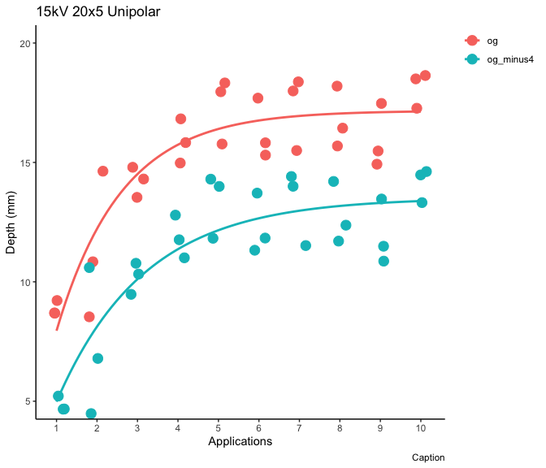

# Start with a clean slate


# Import the cleaned data - Point to the correct raw data directory


# Aesthetics


## Import Subject Data


# Regression Fitting

## Make Testing Data

We take the original data and label it "og", then we take the depth data from "og", subtract 4 from depth and label it's group "og_minus4). 


```
## Joining with `by = join_by(id, species, lesion_num, application_num, voltage,
## pulse_seq, waveform, n_uni, n_bipolar, n_biphasic, n_train_rep, depth,
## diameter, generator, experiment_id, depth_per_width, group)`
```


## 15 kV Unipolar 20x5

### 2-Parameter Nonlinear Asymptotic Regression

#### Depth


```
## 
## Model fitted: Asymptotic regression with lower limit at 0 (2 parms)
## 
## Parameter estimates:
## 
##                       Estimate Std. Error t-value   p-value    
## Upper Limit:og        17.16643    0.38945 44.0783 < 2.2e-16 ***
## Upper Limit:og_minus4 13.51953    0.47145 28.6763 < 2.2e-16 ***
## Steepness:og           1.60712    0.16545  9.7138 1.296e-13 ***
## Steepness:og_minus4    2.17652    0.27358  7.9556 9.149e-11 ***
## ---
## Signif. codes:  0 '***' 0.001 '**' 0.01 '*' 0.05 '.' 0.1 ' ' 1
## 
## Residual standard error:
## 
##  1.433781 (56 degrees of freedom)
```


```
## `geom_smooth()` using formula = 'y ~ x'
```

<!-- -->

### Summary Plot

#### Depth


```
## `geom_smooth()` using formula = 'y ~ x'
```

```
## Warning: Removed 4 rows containing non-finite outside the scale range
## (`stat_smooth()`).
```

```
## Warning: Removed 4 rows containing missing values or values outside the scale range
## (`geom_point()`).
```

<!-- -->

```
## `geom_smooth()` using formula = 'y ~ x'
```

```
## Warning: Removed 4 rows containing non-finite outside the scale range (`stat_smooth()`).
## Removed 4 rows containing missing values or values outside the scale range
## (`geom_point()`).
```

# Version and Package Details


```
## [1] "R version 4.4.0 (2024-04-24) Puppy Cup"
```

```
## [1] "RStudio Version 2024.4.2.764 Chocolate Cosmos"
```

<div class="kable-table">

|         |package  |loadedversion |
|:--------|:--------|:-------------|
|aomisc   |aomisc   |0.652         |
|dplyr    |dplyr    |1.1.4         |
|drc      |drc      |3.2-0         |
|drcData  |drcData  |1.1-3         |
|emmeans  |emmeans  |1.10.2        |
|ggplot2  |ggplot2  |3.5.1         |
|knitr    |knitr    |1.47          |
|MASS     |MASS     |7.3-61        |
|Matrix   |Matrix   |1.7-0         |
|medrc    |medrc    |1.1-0         |
|metadat  |metadat  |1.2-0         |
|metafor  |metafor  |4.6-0         |
|nlme     |nlme     |3.1-165       |
|numDeriv |numDeriv |2016.8-1.1    |
|sfsmisc  |sfsmisc  |1.1-18        |

</div>

# When were these files last rewritten?


```
## [1] "Sun Aug  4 20:49:24 2024"
```
