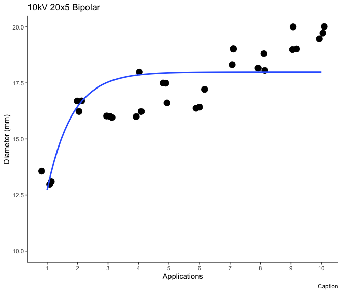

# Start with a clean slate


# Import the cleaned data - Point to the correct raw data directory


# Aesthetics


## Import Subject Data


# Regression Fitting

## 10kV 20x5 Bipolar 

### Asymptotic Regression

#### Depth 


```
## 
## Formula: depth ~ SSasympOrig(application_num, Asym, lrc)
## 
## Parameters:
##      Estimate Std. Error t value Pr(>|t|)    
## Asym   5.4548     0.1139  47.904   <2e-16 ***
## lrc    0.3689     0.1683   2.192   0.0369 *  
## ---
## Signif. codes:  0 '***' 0.001 '**' 0.01 '*' 0.05 '.' 0.1 ' ' 1
## 
## Residual standard error: 0.5498 on 28 degrees of freedom
## 
## Number of iterations to convergence: 0 
## Achieved convergence tolerance: 3.083e-06
```


```
## `geom_smooth()` using formula = 'y ~ x'
```

<!-- -->


#### Diameter


```
## 
## Formula: diameter ~ SSasympOrig(application_num, Asym, lrc)
## 
## Parameters:
##      Estimate Std. Error t value Pr(>|t|)    
## Asym  17.9885     0.2560  70.255   <2e-16 ***
## lrc    0.2076     0.1012   2.051   0.0497 *  
## ---
## Signif. codes:  0 '***' 0.001 '**' 0.01 '*' 0.05 '.' 0.1 ' ' 1
## 
## Residual standard error: 1.203 on 28 degrees of freedom
## 
## Number of iterations to convergence: 0 
## Achieved convergence tolerance: 3.601e-06
```


```
## `geom_smooth()` using formula = 'y ~ x'
```

<!-- -->

#### Depth/Diameter Ratio


```
## 
## Call: rlm(formula = depth_per_width ~ application_num, data = working_dat, 
##     subset = (voltage == 10 & pulse_seq == "20x5" & waveform == 
##         "bipolar"))
## Residuals:
##        Min         1Q     Median         3Q        Max 
## -0.0486719 -0.0130040  0.0009946  0.0129954  0.0599943 
## 
## Coefficients:
##                 Value   Std. Error t value
## (Intercept)      0.3107  0.0090    34.6929
## application_num -0.0007  0.0014    -0.4621
## 
## Residual standard error: 0.02025 on 28 degrees of freedom
```

```
## 
## 	robust F-test (as if non-random weights)
## 
## data:  from rlm(formula = depth_per_width ~ application_num, data = working_dat, from     subset = (voltage == 10 & pulse_seq == "20x5" & waveform == from         "bipolar"))
## F = 0.21088, p-value = 0.6496
## alternative hypothesis: true application_num is not equal to 0
```


```
## `geom_smooth()` using formula = 'y ~ x'
```

<!-- -->

## 10 kV Fast-Switch 10x5

### 2-Parameter Nonlinear Asymptotic Regression

#### Depth


```
## 
## Formula: depth ~ SSasympOrig(application_num, Asym, lrc)
## 
## Parameters:
##      Estimate Std. Error t value Pr(>|t|)    
## Asym  10.7792     0.4758  22.656  < 2e-16 ***
## lrc   -0.9984     0.1546  -6.459 1.12e-06 ***
## ---
## Signif. codes:  0 '***' 0.001 '**' 0.01 '*' 0.05 '.' 0.1 ' ' 1
## 
## Residual standard error: 1.058 on 24 degrees of freedom
## 
## Number of iterations to convergence: 6 
## Achieved convergence tolerance: 5.975e-06
##   (4 observations deleted due to missingness)
```


```
## `geom_smooth()` using formula = 'y ~ x'
```

```
## Warning: Removed 4 rows containing non-finite outside the scale range
## (`stat_smooth()`).
```

```
## Warning: Removed 4 rows containing missing values or values outside the scale range
## (`geom_point()`).
```

<!-- -->

#### Diameter


```
## 
## Formula: diameter ~ SSasympOrig(application_num, Asym, lrc)
## 
## Parameters:
##      Estimate Std. Error t value Pr(>|t|)    
## Asym 23.11464    0.25795  89.610   <2e-16 ***
## lrc  -0.01488    0.10526  -0.141    0.889    
## ---
## Signif. codes:  0 '***' 0.001 '**' 0.01 '*' 0.05 '.' 0.1 ' ' 1
## 
## Residual standard error: 1.117 on 22 degrees of freedom
## 
## Number of iterations to convergence: 6 
## Achieved convergence tolerance: 2.657e-06
##   (6 observations deleted due to missingness)
```


```
## `geom_smooth()` using formula = 'y ~ x'
```

```
## Warning: Removed 6 rows containing non-finite outside the scale range
## (`stat_smooth()`).
```

```
## Warning: Removed 6 rows containing missing values or values outside the scale range
## (`geom_point()`).
```

<!-- -->

#### Depth/Diameter Ratio


```
## 
## Call: rlm(formula = depth_per_width ~ application_num, data = working_dat, 
##     subset = (voltage == 10 & pulse_seq == "10x5" & waveform == 
##         "fast-switch"))
## Residuals:
##       Min        1Q    Median        3Q       Max 
## -0.064314 -0.030335  0.001609  0.025777  0.082721 
## 
## Coefficients:
##                 Value   Std. Error t value
## (Intercept)      0.2713  0.0254    10.6757
## application_num  0.0207  0.0037     5.5919
## 
## Residual standard error: 0.04558 on 22 degrees of freedom
##   (6 observations deleted due to missingness)
```

```
## 
## 	robust F-test (as if non-random weights)
## 
## data:  from rlm(formula = depth_per_width ~ application_num, data = working_dat, from     subset = (voltage == 10 & pulse_seq == "10x5" & waveform == from         "fast-switch"))
## F = 31.606, p-value = 1.186e-05
## alternative hypothesis: true application_num is not equal to 0
```


```
## `geom_smooth()` using formula = 'y ~ x'
```

```
## Warning: Removed 6 rows containing non-finite outside the scale range
## (`stat_smooth()`).
```

```
## Warning: Removed 6 rows containing missing values or values outside the scale range
## (`geom_point()`).
```

<!-- -->

## 15kV Unipolar 15x5

### 2-Parameter Nonlinear Asymptotic Regression

#### Depth


```
## 
## Formula: depth ~ SSasympOrig(application_num, Asym, lrc)
## 
## Parameters:
##      Estimate Std. Error t value Pr(>|t|)    
## Asym   22.021      1.194  18.449  < 2e-16 ***
## lrc    -1.199      0.147  -8.155 7.06e-09 ***
## ---
## Signif. codes:  0 '***' 0.001 '**' 0.01 '*' 0.05 '.' 0.1 ' ' 1
## 
## Residual standard error: 2.212 on 28 degrees of freedom
## 
## Number of iterations to convergence: 0 
## Achieved convergence tolerance: 9.331e-07
```


```
## `geom_smooth()` using formula = 'y ~ x'
```

<!-- -->

#### Diameter


```
## 
## Formula: diameter ~ SSasympOrig(application_num, Asym, lrc)
## 
## Parameters:
##      Estimate Std. Error t value Pr(>|t|)    
## Asym  44.7887     1.0677  41.947  < 2e-16 ***
## lrc   -0.5055     0.1053  -4.802 4.77e-05 ***
## ---
## Signif. codes:  0 '***' 0.001 '**' 0.01 '*' 0.05 '.' 0.1 ' ' 1
## 
## Residual standard error: 3.879 on 28 degrees of freedom
## 
## Number of iterations to convergence: 0 
## Achieved convergence tolerance: 3.457e-06
```


```
## `geom_smooth()` using formula = 'y ~ x'
```

<!-- -->

#### Depth/Diameter Ratio


```
## 
## Call: rlm(formula = depth_per_width ~ application_num, data = working_dat, 
##     subset = (voltage == 15 & pulse_seq == "15x5" & waveform == 
##         "unipolar"))
## Residuals:
##       Min        1Q    Median        3Q       Max 
## -0.083285 -0.036906 -0.003191  0.035454  0.101856 
## 
## Coefficients:
##                 Value   Std. Error t value
## (Intercept)      0.3235  0.0199    16.2198
## application_num  0.0150  0.0032     4.6524
## 
## Residual standard error: 0.05542 on 28 degrees of freedom
```

```
## 
## 	robust F-test (as if non-random weights)
## 
## data:  from rlm(formula = depth_per_width ~ application_num, data = working_dat, from     subset = (voltage == 15 & pulse_seq == "15x5" & waveform == from         "unipolar"))
## F = 21.843, p-value = 6.768e-05
## alternative hypothesis: true application_num is not equal to 0
```


```
## `geom_smooth()` using formula = 'y ~ x'
```

<!-- -->

## 15 kV Unipolar 20x5

### 2-Parameter Nonlinear Asymptotic Regression - NLS

#### Depth


```
## 
## Formula: depth ~ SSasympOrig(application_num, Upper_Limit, Steepness)
## 
## Parameters:
##             Estimate Std. Error t value Pr(>|t|)    
## Upper_Limit  17.1664     0.3889  44.142  < 2e-16 ***
## Steepness    -0.4744     0.1021  -4.645 7.31e-05 ***
## ---
## Signif. codes:  0 '***' 0.001 '**' 0.01 '*' 0.05 '.' 0.1 ' ' 1
## 
## Residual standard error: 1.439 on 28 degrees of freedom
## 
## Number of iterations to convergence: 0 
## Achieved convergence tolerance: 3.543e-07
```


```
## `geom_smooth()` using formula = 'y ~ x'
```

<!-- -->

#### Diameter


```
## 
## Formula: diameter ~ SSasympOrig(application_num, Upper_Limit, Steepness)
## 
## Parameters:
##             Estimate Std. Error t value Pr(>|t|)    
## Upper_Limit 55.29194    1.26948  43.555  < 2e-16 ***
## Steepness   -0.74753    0.08598  -8.694 1.92e-09 ***
## ---
## Signif. codes:  0 '***' 0.001 '**' 0.01 '*' 0.05 '.' 0.1 ' ' 1
## 
## Residual standard error: 3.869 on 28 degrees of freedom
## 
## Number of iterations to convergence: 0 
## Achieved convergence tolerance: 7.852e-07
```


```
## `geom_smooth()` using formula = 'y ~ x'
```

<!-- -->

### Summary Plot

#### Diameter


```
## `geom_smooth()` using formula = 'y ~ x'
```

```
## Warning: Removed 6 rows containing non-finite outside the scale range
## (`stat_smooth()`).
```

```
## Warning: Removed 6 rows containing missing values or values outside the scale range
## (`geom_point()`).
```

<!-- -->

#### Depth


```
## `geom_smooth()` using formula = 'y ~ x'
```

```
## Warning: Removed 4 rows containing non-finite outside the scale range
## (`stat_smooth()`).
```

```
## Warning: Removed 4 rows containing missing values or values outside the scale range
## (`geom_point()`).
```

<!-- -->

#### Depth/Diameter Ratio Regression Plot


```
## `geom_smooth()` using formula = 'y ~ x'
```

```
## Warning: Removed 6 rows containing non-finite outside the scale range
## (`stat_smooth()`).
```

```
## Warning: Removed 6 rows containing missing values or values outside the scale range
## (`geom_point()`).
```

<!-- -->

```
## `geom_smooth()` using formula = 'y ~ x'
```

```
## Warning: Removed 6 rows containing non-finite outside the scale range (`stat_smooth()`).
## Removed 6 rows containing missing values or values outside the scale range
## (`geom_point()`).
```


# Version and Package Details


```
## [1] "R version 4.4.0 (2024-04-24) Puppy Cup"
```

```
## [1] "RStudio Version 2024.4.2.764 Chocolate Cosmos"
```

<div class="kable-table">

|         |package  |loadedversion |
|:--------|:--------|:-------------|
|aomisc   |aomisc   |0.652         |
|dplyr    |dplyr    |1.1.4         |
|drc      |drc      |3.2-0         |
|drcData  |drcData  |1.1-3         |
|emmeans  |emmeans  |1.10.2        |
|ggplot2  |ggplot2  |3.5.1         |
|knitr    |knitr    |1.47          |
|MASS     |MASS     |7.3-61        |
|Matrix   |Matrix   |1.7-0         |
|medrc    |medrc    |1.1-0         |
|metadat  |metadat  |1.2-0         |
|metafor  |metafor  |4.6-0         |
|nlme     |nlme     |3.1-165       |
|numDeriv |numDeriv |2016.8-1.1    |
|sfsmisc  |sfsmisc  |1.1-18        |

</div>

# When were these files last rewritten?


```
## [1] "Fri Aug  2 14:02:53 2024"
```
